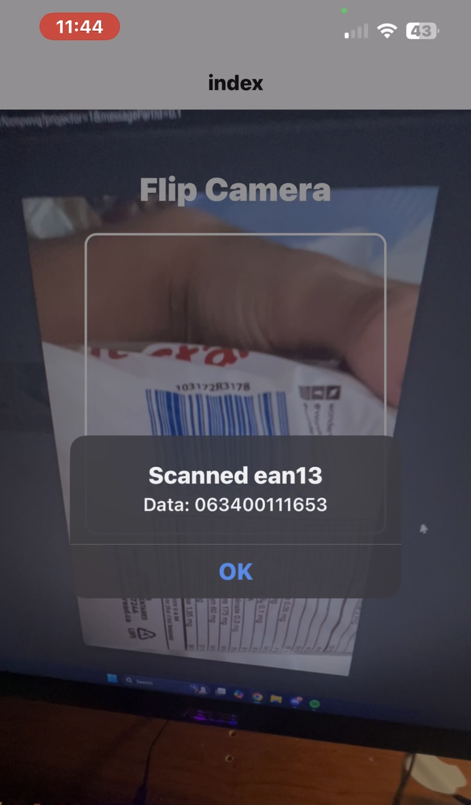
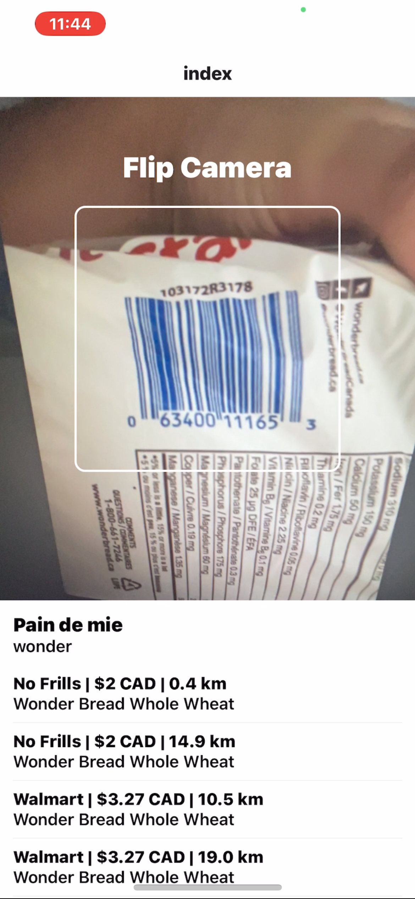
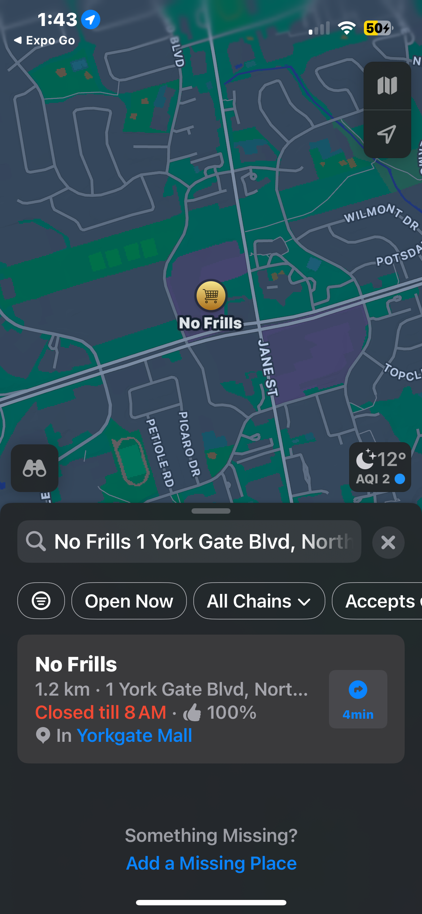

# Cheap Product Scanner (Prototype)
A mobile app that allows users to scan grocery products barcodes (EAN-13/UPC) and instantly look up the cheapest nearby prices from stores like Walmart, No Frills, and Sobeys (Canada-based)

## Tech Stack
### Frontend
1. React Native (Expo)
2. Expo Camera
3. Expo Location
### Backend
1. Node.js (Express)
### Tools & APIs
1. OpenFoodFacts API
2. Apple Maps
3. Manual product dataset

## Requirement
BASE_URL: `http://${process.env.USER_IP}:4000` |
USER_IP: `your.local.ip.address`

## Setup and Run
### Frontend
```
cd CheapProductsApp
npm install
npx expo start
```
### Backend
```
cd barcode-offers-api
npm install
node index.js
```

## Images





